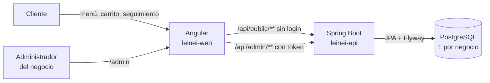

# Leinei · tienda en línea de marca blanca

Una sola base de código para que cualquier negocio tenga su propia tienda en línea: comidas rápidas, postres, panaderías, restaurantes, mercados… Cada negocio instala su copia y desde su panel configura **nombre, logo, colores, catálogo, precios, opciones, horarios, domicilios y pagos**. El cliente final nunca ve la palabra "Leinei".

- **Clientes:** ven el menú por categorías, personalizan productos (tamaño, adiciones, "sin cebolla"), escogen domicilio o recoger en el local, pagan por transferencia o en efectivo y siguen su pedido con el código y su celular.
- **Administrador del negocio:** maneja pedidos, pagos, ventas del día, productos, categorías, promociones y toda la configuración de la tienda.

```
leinei/
├── docker-compose.yml   ← PostgreSQL para desarrollo
├── ejemplos/            ← Datos de ejemplo: Leinei (postres) y La Parrilla Express (comidas rápidas)
├── leinei-api/          ← Backend: Java 21 + Spring Boot 4.1.1 + PostgreSQL
└── leinei-web/          ← Frontend: Angular 22 (tienda + panel)
```

---

## 1. Cómo funciona la marca blanca

**Una instalación = un negocio.** Para cada negocio nuevo se despliega una copia del mismo código con su propia base de datos y su propio dominio (por ejemplo `pedidos.laparrilla.com`). No hay un panel central: cada negocio es dueño de su instalación.

Todo lo que cambia de un negocio a otro vive en la base de datos y se edita desde **Panel → Mi tienda**:

| Qué | Dónde se configura |
|---|---|
| Nombre, eslogan, título y mensaje de la portada | Mi tienda → Marca |
| Logo (también se usa como ícono de la pestaña) | Mi tienda → Marca |
| Color principal y secundario, con vista previa | Mi tienda → Marca |
| WhatsApp, dirección, ciudad, Instagram | Mi tienda → Contacto |
| Cuentas para transferir (Nequi, Daviplata, banco, llave Bre-B) y efectivo | Mi tienda → Pagos |
| **Entrega inmediata** con horario por día (comidas rápidas) o **entrega programada** un día fijo con hora de cierre (postres, tortas) | Mi tienda → Cómo recibes pedidos |
| Tiempo estimado de entrega, pedido mínimo, pausar la tienda | Mi tienda → Cómo recibes pedidos |
| Domicilio con valor fijo o por **zonas/barrios**, y **recoger en el local** | Mi tienda → Entregas |
| Categorías del menú y su orden | Categorías |
| Productos con foto, precio, costo, etiqueta y **grupos de opciones** (tamaño, adiciones con precio, ingredientes para quitar) | Productos |
| Combos, descuentos por porcentaje, precio especial y domicilio gratis | Promociones |
| Otros administradores del negocio | Mi tienda → Administradores |

La app aplica los colores en toda la tienda y el panel, en modo claro y oscuro; los tonos de fondo, bordes y textos se derivan automáticamente de los dos colores de la marca.

---

## 2. Arquitectura



**Reglas que cuida el backend:**

- **Precios:** los calcula siempre la API (`PrecioService`). Precio unitario = precio del producto (o su precio especial) + opciones escogidas. Entre combo y porcentaje se aplica solo el que más descuenta; en los combos las adiciones se cobran aparte. El domicilio gratis se suma aparte.
- **Opciones:** la API valida que cada opción sea de ese producto, que esté disponible y que se respete el mínimo y máximo de cada grupo.
- **Disponibilidad** (`DisponibilidadService`, hora de Colombia):
  - *Inmediata:* recibe pedidos dentro del horario; los turnos pueden pasar la medianoche (6 p. m. a 2 a. m.) y el pedido cuenta para el día en que empezó el turno. Fuera de horario muestra cuándo abre.
  - *Programada:* un día de entrega fijo con cierre N días antes a una hora. Pasado el cierre, queda para la otra semana.
- **Estados:** Nuevo → Confirmado → Preparando → *En camino* (domicilio) o *Listo para recoger* (recoger) → Entregado. Se puede cancelar mientras no esté entregado y reabrir un cancelado. Cada cambio queda en el historial que ve el cliente.
- **Privacidad:** el cliente nunca ve costos, ganancias ni datos de otros clientes. El seguimiento pide código **y** celular.
- **Seguridad del panel:** tokens de sesión aleatorios de 12 horas; en la base solo se guarda su hash SHA-256. Claves con BCrypt.
- **Imágenes:** logo y fotos se guardan en la base (tabla `archivo`) para que la app funcione en cualquier hosting sin disco. Solo PNG, JPG o WebP de hasta 2 MB, validados por su contenido.

### Modelo de datos

| Tabla | Para qué |
|---|---|
| `config_tienda` | Marca, contacto, modo de pedido, entrega, pagos y gasto operativo (una sola fila) |
| `horario` | Horario de atención por día (modo inmediato) |
| `zona_envio` | Zonas o barrios con su valor de domicilio |
| `cuenta_pago` | Cuentas para transferir: entidad, titular y número |
| `archivo` | Logo y fotos de productos |
| `categoria` | Secciones del menú |
| `producto` | Productos: precio, costo, foto, etiqueta, disponible, orden |
| `grupo_opcion` / `opcion` | Grupos de opciones con mínimo y máximo, y cada opción con su precio adicional |
| `promocion` / `promocion_producto` | Combos, porcentajes, precios especiales y domicilio gratis |
| `pedido` / `pedido_item` / `pedido_evento` | Pedido con tipo de entrega y zona, sus productos con las opciones escogidas y su historial |
| `admin_usuario` / `admin_sesion` | Administradores y sus sesiones |

### API

| Método | Ruta | Qué hace |
|---|---|---|
| GET | `/api/public/catalogo` | Marca, disponibilidad, categorías, productos con opciones y promociones |
| POST | `/api/public/cotizar` | Total del carrito según entrega y zona |
| POST | `/api/public/pedidos` | Crea el pedido y devuelve el código `P-XXXXXX` |
| GET | `/api/public/pedidos/{codigo}?celular=` | Seguimiento |
| GET | `/api/public/archivos/{id}` | Logo o foto |
| POST | `/api/admin/auth/login` · `/logout` · `/clave` | Sesión y cambio de clave |
| GET/POST | `/api/admin/auth/usuarios` | Administradores |
| GET/POST | `/api/admin/pedidos` | Lista con filtros y pedido manual (WhatsApp o teléfono) |
| PATCH | `/api/admin/pedidos/{id}/estado` · `/pago` | Estado y pago |
| GET | `/api/admin/reportes/produccion?fecha=` · `/fechas` | Ventas del día |
| POST | `/api/admin/archivos` | Subir imagen (multipart, campo `archivo`) |
| CRUD | `/api/admin/categorias`, `/productos`, `/promociones` | Catálogo |
| GET/PUT | `/api/admin/config` | Configuración completa de la tienda |

Los errores llegan como `{ "status": 400, "detail": "Mensaje para mostrar" }` y el frontend muestra `detail` tal cual.

---

## 3. Correrlo en tu computador

Necesitas **JDK 21+**, **Maven 3.9+**, **Node.js 22 LTS o más nuevo** y **Docker Desktop**.

```bash
docker compose up -d                 # base de datos
cd leinei-api && mvn spring-boot:run # API en http://localhost:8080
cd leinei-web && npm install && npm start   # tienda en http://localhost:4200
```

La primera vez la API crea las tablas, una configuración neutra ("Mi tienda") y el administrador **admin** con clave **cambia-esta-clave**. Entra a `http://localhost:4200/admin`, cambia la clave y configura la tienda.

**¿Ya habías corrido la versión anterior (solo postres)?** El esquema cambió. Borra la base de desarrollo y vuelve a arrancar: `docker compose down -v && docker compose up -d`.

### Cargar un ejemplo

Después de arrancar la API una vez:

```bash
# Postres con entrega programada los domingos
docker exec -i leinei-db psql -U leinei -d leinei < ejemplos/leinei-postres.sql
# Comidas rápidas con horario, zonas, recoger en el local y adiciones
docker exec -i leinei-db psql -U leinei -d leinei < ejemplos/comidas-rapidas.sql
```

Usa uno a la vez, sobre una base limpia.

Pruebas del backend: `cd leinei-api && mvn test` (precios, combos con adiciones, horarios que pasan la medianoche, entregas programadas, estados, validación de imágenes).

---

## 4. Instalar la app a un negocio nuevo

1. **Base de datos:** crea un PostgreSQL para ese negocio (Neon, Supabase, Railway o un VPS).
2. **API:** despliega `leinei-api` (hay `Dockerfile`) en Render, Railway o un VPS con estas variables:

   | Variable | Ejemplo |
   |---|---|
   | `DB_URL` | `jdbc:postgresql://host:5432/laparrilla` |
   | `DB_USER` / `DB_PASSWORD` | credenciales de esa base |
   | `ADMIN_USER` / `ADMIN_NAME` / `ADMIN_PASSWORD` | primer administrador del negocio |
   | `CORS_ORIGINS` | `https://pedidos.laparrilla.com` |
   | `PORT` | `8080` |

3. **Frontend:** en `leinei-web/src/environments/environment.ts` pon la dirección de la API de ese negocio, corre `npm run build` y sube `dist/leinei-web/browser` a Netlify, Vercel o Cloudflare Pages, con la regla "todas las rutas a index.html".
4. **Dominio:** apunta el dominio del negocio al frontend.
5. **Entrega:** dale al dueño su usuario y clave. Desde el panel sube su logo, escoge sus colores, arma su menú y define horarios, zonas y cuentas. No hace falta tocar código.

---

## 5. Siguientes pasos sugeridos

- Límite de intentos en el login y en el seguimiento.
- Avisos automáticos por WhatsApp (API de WhatsApp Business) cuando el pedido cambia de estado.
- Configurar la URL de la API al desplegar sin recompilar el frontend (un `config.json` leído al arrancar).
- Impresión de comandas para la cocina.
